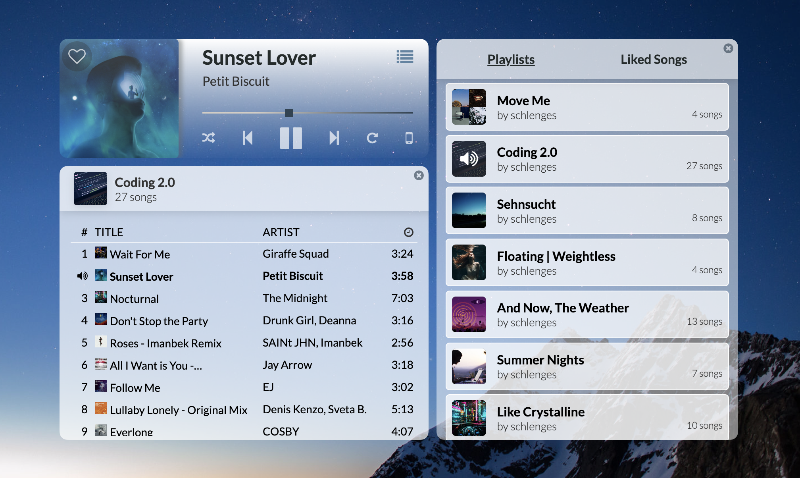

<p align="center">
  <h1 align="center">Selenite</h1>

  <p align="center">
     <strong>A Clean and Minimalist Spotify (Premium) Desktop Player for MacOS</strong>
    <br>
  </p>
  <a href="https://github.com/Selenite-Player/Selenite">
    
  </a> 
</p>


## Table of contents
- [About the App](#about-the-app)
- [Installation](#installation)
- [Technical](#technical)
- [Bugs and Features](#bugs-and-features)

## About the App

Selenite is a cleaner, more minimalist alternative for navigating Spotify on MacOS. Control the song playback, add and remove items from your "liked songs" library and browse your playlists, all within a compact interface.

### How it works

Selenite makes use of [Spotify's Web API](https://developer.spotify.com/documentation/web-api/), this means the app runs alongside Spotify (whether you have Spotify running in your browser or any of the official apps). It won't replace the actual application you are listening with, but adds an extra interface to navigate the Spotify playback of whichever device or app you are using. To fully be able to access all functionality, you need a Spotify Premium account.

### Installation / Dev Setup

1. Clone the [repository](https://github.com/Selenite-Player/Selenite).
2. Install all dependencies via ```npm install```.
3. Go through the [Spotify setup](#spotify-setup) steps detailed in the next paragraph.
4. Start the app with ```npm run start:app```.
5. Enter your Spotify Client ID.

### Spotify Setup

To use this app, you will need to get a ```Client Id``` from Spotify and [add the app to your developer account](https://developer.spotify.com/documentation/general/guides/authorization/app-settings/):

1. Go to the [Spotify Developer Dashboard](https://developer.spotify.com/dashboard/).
2. Click on "_Create an App_" and enter a name and description of your choice.
3. You also need to provide a _redirect URI_. Per default, Selenite is set to use port 8888, so the URI will be ```http://localhost:8888/callback```.
4. Once you save and the app is registered, you will be redirected to the app overview page. Here you will find your ```Client ID```. You will need it later to authenticate your Spotify account.

### Usage

Upon first launch, Selenite will ask for your [Spotify Client ID](#spotify-setup). Once you save your ID, the app will open a Spotify login page and ask for permission to view your account data (for login and authentication), your activity on Spotify (to retrieve playback information), and to take actions in Spotify on your behalf (to add or remove liked songs).  
Selenite itself doesn't access any of your account data, it is only needed by Spotify during the sign-in and authentication process.

Once you are successfully logged in, you will be redirected back to the app. Open Spotify on a device of your choosing and start playing your music or podcasts. Selenite will pick up which device you are listening on and connect to it. Now you can minimize or let Spotify run in the background and navigate your playback via Selenite.

You can play, pause, and skip tracks, as well as enable or disable shuffle and repeat. You can also jump into the middle of a track using the progress bar. If you want to save or remove a song from your library, simply click the heart icon on the cover image. To open your playlists and liked songs library, click on the menu icon in the top right corner. You can either start a playlist directly by clicking on the cover image, or open the list of songs in another window by clicking on the playlist name.

## Technical

### Technologies Used

 


<!-- ### To Do List

You can find the project board with known issues and planned features for the app [here](https://github.com/orgs/Selenite-Player/projects/2). -->

### Bugs and Features

- Found a **bug** or have a concrete **feature request**? Open a corresponding issue via the [Issues Tab](https://github.com/Selenite-Player/Selenite-2.0/issues).

- For any other **feedback**, **questions**, or **ideas**, please use the [Discussions Tab](https://github.com/Selenite-Player/Selenite-2.0/discussions) to reach out.
